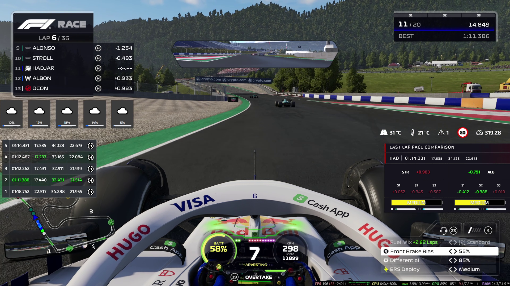

# Pits n' Giggles

## Games supported
- F1 2023
- F1 2024

## Introduction
Tired of seeing every car zoom past you in that F1 online lobby? Well this tool can't really help you with that.<br>
(TBH you just need a better gaming chair. There can't be any other reason, right?)

What this tool can do is provide you with live telemetry data during a race so that you can make more informed decisions.

## Direct executable download (Windows)
You can download the exe file and skip python setup [from here](https://github.com/ashwin-nat/pits-n-giggles/releases)

## Direct executable download (Mac)
Not yet supported because I need a mac to build an executable for mac platforms and I do not own one.

## Prerequisites
- Python
  - [Python Setup Guide for Windows](https://www.python.org/downloads/windows/)
  - [Python Setup Guide for Mac](https://www.python.org/downloads/mac-osx/)
  - [Python Setup Guide for Linux](https://www.python.org/downloads/source/)

## Features
- Live updating and display of race data on the UI
- Supports both player and spectator mode
- In player mode, displays 5 rows including the player (can be configured)
- For each driver, displays track position, name, team, ERS %, best lap, last lap, tyre info and fuel info
  - Tyre info includes average tyre degradation percentage, tyre age, and tyre compound and wear prediction


## Detailed Driver Info
- Clicking on a driver's name shows further detailed info, including:
  - Car damage
  - Tyre damage
  - Tyre wear
  - Tyre wear prediction
  - Current lap data (if race is ongoing)
  - Lap history data
  - ERS history
  - Fuel history
  - Tyre stint history

## Advanced Features

1. Post Race Data Autosave:
   - This feature can be used to make the tool dump all post race data to a JSON file. It is also disabled by default.

2. Stream Overlays
   - Enhance your youtube/twitch streams with realtime data
      - Throttle/Brake/Steering telemetry
      - Lap time history
      - Penalties, track/air temp, speed trap record (only F1 24)
      - Live G Force info
      - Weather Forecast

3. Forwarding
   - Forward the telemetry data to multiple other apps/devices that require this data

4. Packet Capture:
   - This feature can be used to save all the raw incoming packets into a file. It is not enabled by default and needs to be enabled through the command line. The telemetry_replayer.py utility can be used to replay these packets from the specified file to the app, provided the app is launched in --replay-server mode. This is very handy for debugging and development.

## Screenshots

### Main UI
The primary interface of the application, showcasing the clean and intuitive design.


---

### Driver Details - Lap Times
A modal view highlighting detailed lap times for a selected driver.


---

### Driver Details - Tyre Stint
Insights into tyre stints, including usage and performance over laps.


---

### Stream Overlay
A sneak peek at the live telemetry stream overlay designed for use with OBS.


## Running the App (without direct executable)
- The app can be run using the following commands:
  - Run the app using Python:
    ```bash
    python3 app.py
    ```
  - Alternatively, use the provided run scripts:
    - On Windows:
      ```bash
      run.bat
      ```
    - On Unix-based systems (e.g., macOS, Linux):
      ```bash
      run.sh
      ```

## Launch Options in app.py
- The following launch options are available in app.py:

| Short Option | Long Option                      | Description                                                                                            | Default Value  |
|--------------|----------------------------------|--------------------------------------------------------------------------------------------------------|----------------|
| `-p`         | `--packet-capture-mode`          | Packet capture mode (disabled, enabled, enabled-with-autosave)                                        | `disabled`     |
| `-t`         | `--telemetry-port`               | Port number for F1 telemetry client                                                                    | `20777`        |
| `-s`         | `--server-port`                  | Port number for HTTP server                                                                            | `5000`         |
| `-f`         | `--post-race-data-autosave`      | Autosave all race data into a JSON file at the end of the race                                         | N/A            |
|              | `--replay-server`                | Enable the TCP replay debug server                                                                     | N/A            |
|              | `--disable-browser-autoload`      | Set this flag to not open the browser tab automatically                                                | N/A            |
| `-r`         | `--refresh-interval`             | How often the web page should refresh itself with new data                                              | `200`          |
| `-l`         | `--log-file`                     | Write output to specified log file (append)                                                            | `None`         |
| `-d`         | `--debug`                        | Enable debug logs                                                                                      | False          |
| `-u`         | `--udp-custom-action-code`       | UDP custom action code number for recording event markers                                              | `None`         |
| `-n`         | `--num-adjacent-cars`           | How many cars adjacent to your car will be included in the UI during race                              | `2`            |


## Usage - To build your own app on top of this
To develop your own app using the telemetry manager module:
1. Import the telemetry manager module:
    ```python
    from telemetry_manager import F1TelemetryManager
    ```
2. Create an instance of F1TelemetryManager:
    ```python
    telemetry_manager = F1TelemetryManager()
    ```
3. Register the callbacks for handling race data. Only register the packet types that you're interested in
    ```python
    # Register callbacks
    telemetry_manager.registerCallback(F1PacketType.SESSION, your_function)
    ```
4. Call the run method to start receiving and processing race data:
    ```python
    # Start receiving and processing race data
    telemetry_manager.run()
    ```

## Credits
For a few of the charts/graphs in the UI, credits to [F1TelemetryData](https://x.com/F1TelemetryData) on twitter for the ideas