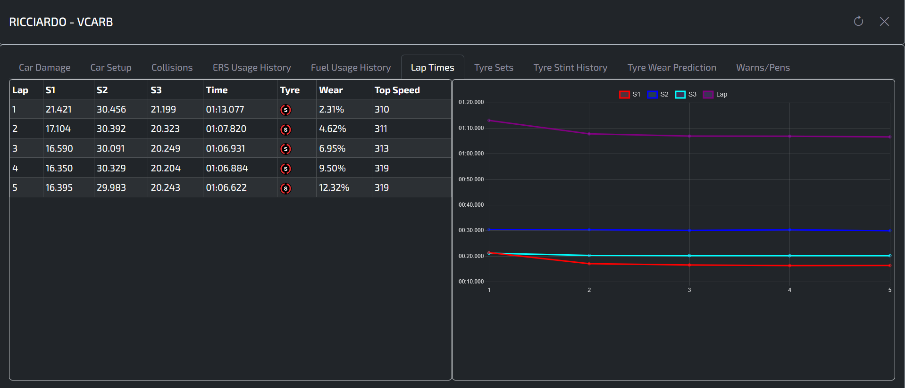

# Pits n' Giggles

## Games supported
- F1 2023
- F1 2024

## Introduction
Tired of seeing every car zoom past you in that F1 online lobby? Well this tool can't really help you with that. 
(TBH you just need a better gaming chair. There can't be any other reason, right?)

What this tool can do is provide you with live telemetry data during a race so that you can make more informed decisions.

## Direct executable download (Windows)
You can download the exe file and skip python setup [from here](https://github.com/ashwin-nat/pits-n-giggles/releases)

## Direct executable download (Mac)
Not yet supported because I need a mac to build an executable for mac platforms and I do not own one.

## Detailed instructions and other features
[Head on over to the wiki page to read all about this](https://github.com/ashwin-nat/pits-n-giggles/wiki)

## Features
- Live updating and display of race data on the UI
- Supports both player and spectator mode
- In player mode, displays 5 rows including the player (can be configured)
- For each driver, displays track position, name, team, ERS %, best lap, last lap, tyre info and fuel info
  - Tyre info includes average tyre degradation percentage, tyre age, and tyre compound and wear prediction

## Detailed Driver Info
- Clicking on a driver's name shows further detailed info, including:
  - Car damage
  - Tyre damage
  - Tyre wear
  - Tyre wear prediction
  - Current lap data (if race is ongoing)
  - Lap history data
  - ERS history
  - Fuel history
  - Tyre stint history

## Advanced Features

1. Post Race Data Autosave:
   - This feature can be used to make the tool dump all post race data to a JSON file. It is also disabled by default.

2. Stream Overlays
   - Enhance your youtube/twitch streams with realtime data
      - Throttle/Brake/Steering telemetry
      - Lap time history
      - Penalties, track/air temp, speed trap record (only F1 24)
      - Live G Force info
      - Weather Forecast

3. Forwarding
   - Forward the telemetry data to multiple other apps/devices that require this data

4. Packet Capture:
   - This feature can be used to save all the raw incoming packets into a file. It is not enabled by default and needs to be enabled through the command line. The telemetry_replayer.py utility can be used to replay these packets from the specified file to the app, provided the app is launched in --replay-server mode. This is very handy for debugging and development.

## Screenshots

### Main UI
The primary interface of the application, showcasing the clean and intuitive design.

---

### Driver Details - Lap Times
A modal view highlighting detailed lap times for a selected driver.

---

### Driver Details - Tyre Stint
Insights into tyre stints, including usage and performance over laps.

---

### Stream Overlay
A sneak peek at the live telemetry stream overlay designed for use with OBS.

## Running the App (without direct executable)
📖 For detailed setup and usage instructions, see [RUNNING.md](RUNNING.md).

## Building the application executables
💻 For building the executable, see [BUILDING.md](BUILDING.md).

## Credits
For a few of the charts/graphs in the UI, credits to [F1TelemetryData](https://x.com/F1TelemetryData) on twitter for the ideas
