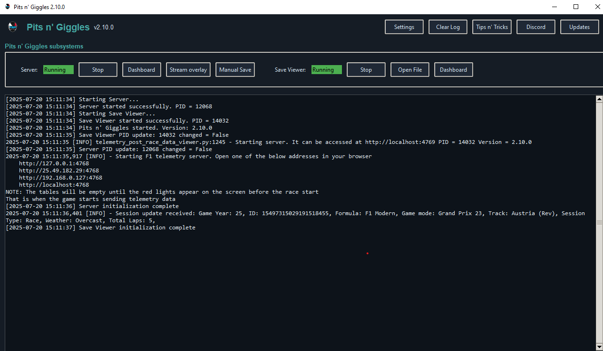
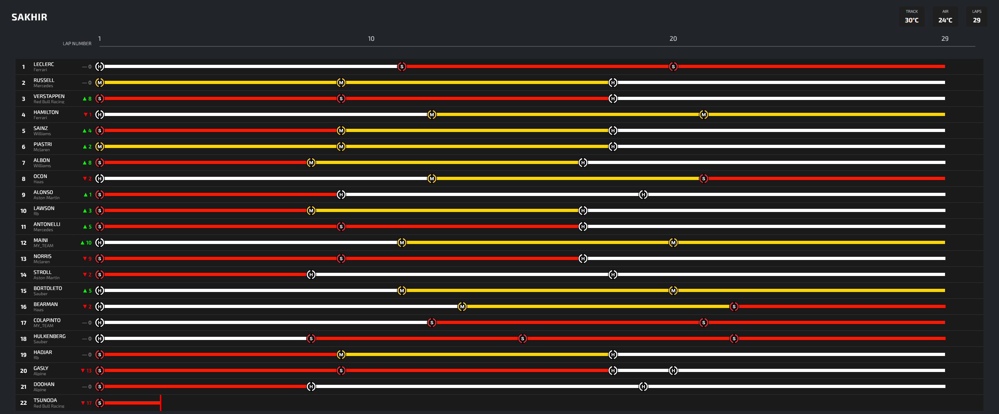
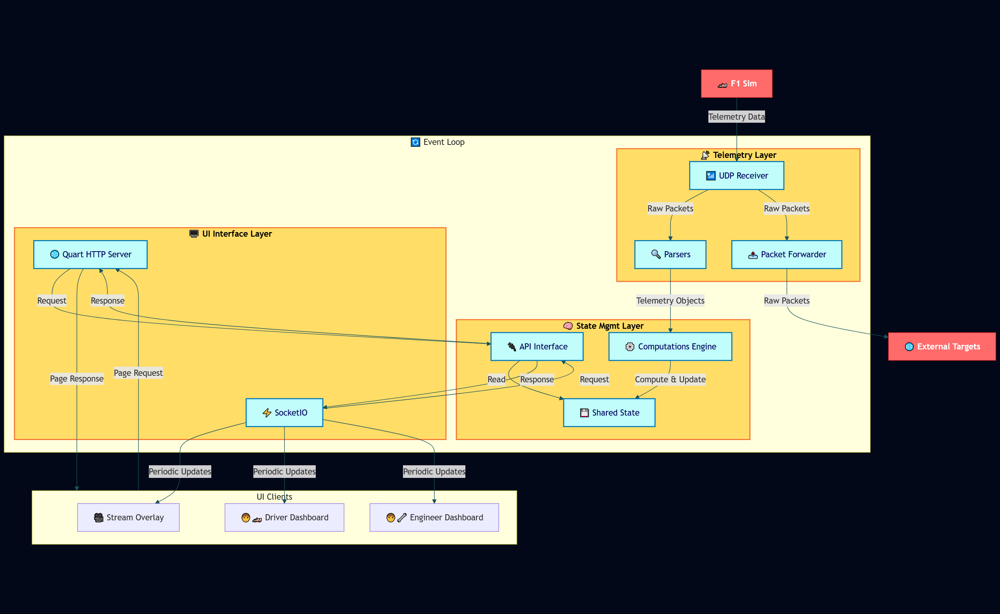

# Pits n' Giggles
**Real-time in-game overlays + advanced F1 telemetry dashboards.**
*(Because racing fast is good. Racing smart is better.)*

## Overview

Pits n' Giggles is a lightweight F1 telemetry companion that brings two major capabilities together:

1. **In-game, always-on-top racing overlays** - lightweight HUD widgets you use *while driving*.
2. **Deep-dive telemetry dashboards** - advanced analysis for tyre wear, lap times, fuel modelling, and more.

Whether you're racing, streaming, analysing performance, or coaching remotely, Pits n' Giggles provides real-time insights without ever slowing you down.

---

## In-Game Overlays (Primary Feature)

Traditional telemetry tools expect you to click around mid-race. Ever tried navigating menus while taking Eau Rouge flat? Exactly.

Pits n' Giggles overlays:

- Stay **always on top** of your game window
- Require **zero mouse interaction**
- Are **high-contrast and glanceable**
- Work seamlessly with streaming setups (OBS-friendly)
- Are designed for wheel users, VR-style driving, and minimal distraction

### Overlay Features
- **Lap deltas** & **estimated lap times** & **dynamic sector color updates**
- **Tyre compound, age, wear, and predictions**
- **ERS usage** & deployment mode indicators
- **Fuel load + live consumption model**
- **Weather & track conditions**

---

## Telemetry Dashboards (Equal Focus)

Beyond the overlays, Pits n' Giggles includes a full browser-based telemetry suite.

### Core Dashboard Features
- Live race table with instant driver comparison
- Player & spectator mode support
- Configurable info density and row count
- Surrounding-cars comparison (N ahead / N behind)
- Distributed design: view telemetry from any device on your network

### Driver Details
Click any driver (preferably not during a fast lap):

- **Lap-by-lap history**
- **Tyre wear**, with regression-based prediction
- **Car damage breakdown**
- **ERS deployment patterns**
- **Fuel consumption modelling** based on your actual driving
- **Stint history & compound strategy analysis**
- Autosaved session JSON for deeper review

---

## Supported Games
- **F1 2023**
- **F1 2024**
- **F1 2025**

---

## Advanced Capabilities
- **OBS-ready stream overlays**
- **Distributed client/server architecture**
- **Real-time data forwarding** to other apps
- **Remote coaching** (engineers can watch from anywhere)
- **Minimal interaction, maximum visibility** design philosophy

---

## Installation

### Windows
Download the EXE from the [Releases Page](https://github.com/ashwin-nat/pits-n-giggles/releases).

### macOS
Build from source (macOS executables require mac hardware).
See **[RUNNING.md](docs/RUNNING.md)**.

### Manual / Source Installation
- How to run → **[RUNNING.md](docs/RUNNING.md)**
- How to build → **[BUILDING.md](docs/BUILDING.md)**

---

## Screenshots

### In-Game HUD Overlay

### Main Interface

### Lap Times

### Tyre Stint

### Stream Overlay Example

### Launcher

### Position History

### Tyre Stint History

---

## Architecture

## Documentation
Full guides & documentation:
  https://www.pitsngiggles.com/blog

---

## Contributing
Issues and PRs are welcome! Continuous development, minus the FIA politics.

## License
MIT License.
