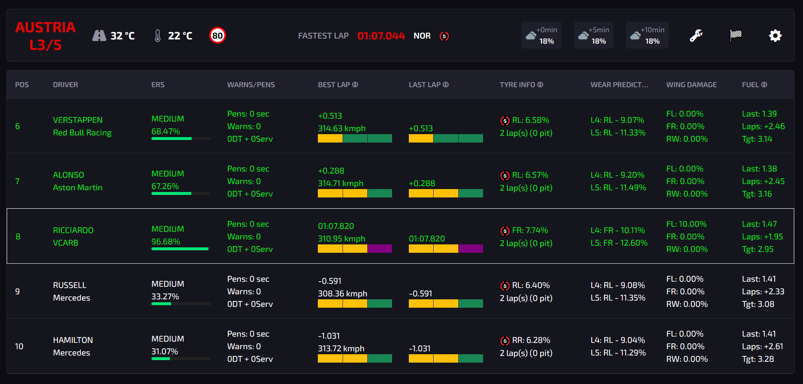
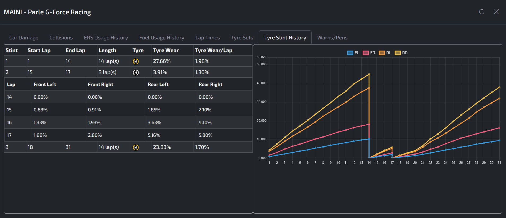

# Pits n' Giggles 🏎️💨

A real-time F1 telemetry dashboard for enhancing your racing experience.
*(Because knowing why you crashed is almost as fun as not crashing!)*

## Overview

Pits n' Giggles provides live telemetry data during F1 races, giving you valuable insights to make informed decisions on track. While it can't replace that gaming chair you desperately need to catch the competition (seriously, it's always the chair, right? 🪑✨), it offers comprehensive race analytics in an intuitive interface.

### The Problem We Solve 🔧

Most F1 telemetry applications require extensive mouse interaction to access critical data - a major challenge when you're focused on driving. Try clicking precisely while taking Eau Rouge at 300 km/h... we'll wait. ⏱️

Pits n' Giggles solves this by:

- Displaying essential information without requiring active navigation (your hands thank you 🙌)
- Using a clean, glanceable interface that minimizes distraction (eyes on the road, hotshot!)
- Implementing a distributed client/server architecture that allows:
  - Remote monitoring by team members in different geographic locations (backseat drivers, but useful! 🌎)
  - Separation of display and data collection for flexible setups
  - Performance analysis without interrupting your driving flow

## Supported Games 🎮

- F1 2023
- F1 2024
- *(F1 Manager support coming right after we finish this lap... just one more lap...)*

## Features

### Core Functionality 🏁
- Real-time telemetry data visualization designed for at-a-glance reading while driving
- Minimal interaction required - critical data is always visible without clicking (no more "hold my steering wheel" moments)
- Two specialized view modes:
  - **Driver Mode**: Streamlined for when you're racing
  - **Engineer Mode**: Comprehensive when supporting a driver
- Support for both player and spectator modes (spy on your friends' driving mistakes! 👀)
- Configurable display (up to 5 rows including player in player mode)
- Comprehensive driver information:
  - Track position (for when you need proof you're not last)
  - Driver name and team
  - ERS percentage (use it or lose it! ⚡)
  - Best and last lap times
  - Detailed tyre information (compound, age, degradation) (tyre whisperer mode activated 🔮)
  - Fuel status (how many laps until you're pushing your car to the finish line?)
  - Linear regression-based tyre wear predictions based on your actual driving style
  - Personalized fuel consumption models that adapt to your driving patterns
  - Unlike the game's static calculations, our predictions use your real-time data!

### Detailed Driver Analytics 📊
Click on any driver's name to access (when you're safely in the pits, of course):
- Car damage breakdown (find out exactly what you hit this time!)
- Tyre wear statistics and predictions:
  - Linear regression models based on your actual driving data
  - More accurate than the game's static calculations
  - Personalized to your driving style and track conditions
- Current lap data (during races)
- Complete lap history (receipts for when your friend claims they were "always faster")
- ERS deployment history
- Fuel consumption trends with predictive modeling:
  - Dynamic calculations based on your throttle patterns
  - Adapts to your driving style instead of using the game's default estimates
  - Helps make strategic decisions about fuel saving or pushing
- Tyre stint history (prove your 40-lap stint on softs was actually genius)

### Advanced Capabilities 🚀
- **Two Specialized Modes**:
  - Driver Mode: Focused data for racers at the wheel
  - Engineer Mode: Comprehensive analysis for team support
- **Predictive Analytics**:
  - Custom tyre wear models using linear regression on your actual driving data
  - Personalized fuel consumption predictions that adapt to your specific throttle/braking patterns
  - Much more accurate than the game's default calculations which don't account for driving style
- **Post-Race Data Autosave**: Automatically export race data to JSON (for when you need scientific proof of how unlucky you were)
- **Stream Overlays**: Enhance your broadcasts with real-time data:
  - Throttle/Brake/Steering inputs (show viewers your superhuman reflexes)
  - Lap time history (visual representation of your consistency or lack thereof)
  - Penalties, track/air temperature, speed trap records (F1 24 only)
  - Live G-Force visualization (neck muscles not included 💪)
  - Weather forecast (for dramatic "rain is coming" commentary)
- **Data Forwarding**: Send telemetry to other applications or devices
- **Distributed Architecture**:
  - Connect with team members across different locations
  - Separate telemetry collection from visualization for optimal performance
  - Enable remote coaching and strategy support (hear "I told you so" from anywhere in the world! 🌍)

## Installation 🛠️

### Windows Users
Download the executable directly from our [releases page](https://github.com/ashwin-nat/pits-n-giggles/releases).

### Mac Users
Mac executables are not yet available as they require building on macOS hardware.
Follow the Python setup instructions below instead.

### Manual Setup (All Platforms)
For detailed setup instructions including Python environment configuration, see [RUNNING.md](RUNNING.md).

## Building From Source
To compile the application from source code, follow the instructions in [BUILDING.md](BUILDING.md). No PhD in computer science required.)

### Mac Users
Mac executables are not yet available as they require building on macOS hardware.
(Anyone want to donate a Mac? ...No? Worth a shot! 🍎)

Follow the Python setup instructions below instead.

### Manual Setup (All Platforms)
For detailed setup instructions including Python environment configuration, see [RUNNING.md](RUNNING.md).

## Building From Source
To compile the application from source code, follow the instructions in [BUILDING.md](BUILDING.md).

## Screenshots

### Main Interface

### Driver Details - Lap Times

### Driver Details - Tyre Stint

### Stream Overlay Example

## Architecture

## Documentation 📚
For comprehensive documentation and usage guides, visit our [Wiki](https://github.com/ashwin-nat/pits-n-giggles/wiki).
(It's like the F1 technical regulations, but actually readable!)

## Credits
UI chart and visualization concepts inspired by [F1TelemetryData](https://x.com/F1TelemetryData) on Twitter.

## Contributing 🤝
Contributions are welcome! Feel free to submit issues or pull requests to help improve Pits n' Giggles.
(Just like F1, we believe in continuous development... minus the $145 million budget cap.)

## License 📜
[MIT License](LICENSE)
(Unless you're the FIA, in which case, we have a completely different license... nevermind.)