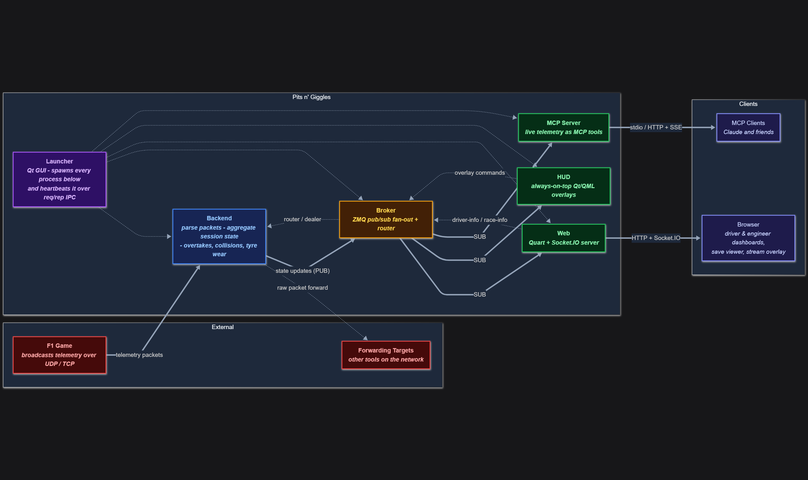

# Pits n' Giggles Backend

This app is the brain (and heart) behind Pits n' Giggles. It does the following
- Receive data from the F1 game
- Parse compute and maintain the state of the session
- Coordinate with the UI clients

## Running

From the root directory
```bash
poetry run python -m apps.backend
```

## App Architecture



The backend uses a **lock-free state management design** to ensure high performance and simplicity in an async environment.

### Writer Functions (`process*`)

- All shared session state is written by a **single writer task**.
- Writer functions are prefixed with `process` and defined in [`session_state.py`](https://github.com/ashwin-nat/pits-n-giggles/blob/main/apps/backend/state_mgmt_layer/session_state.py).
- Each writer function:
  - Mutates in-memory shared state **synchronously**. (since all compute and update operations are CPU bound)
  - Calls `await` only **after** all shared state updates are complete.
  - Does **not** modify shared state after an `await`.

This design ensures that:
- Shared state writes are **effectively atomic**.
- Readers will never see a half-updated state.
- No `asyncio.Lock` or other synchronization is required.

### Readers

- Multiple async reader tasks may read shared state concurrently.
- Readers **do not mutate** shared state.
- Some amount of **stale data is acceptable**, as readers poll a few times per second.
- No locking is required for reads due to the one-writer lock-free model.

> ✅ This lock-free approach avoids coordination overhead while ensuring correctness and performance.

### Offloading I/O-bound Work

The telemetry packet processing task is designed to run as efficiently as possible and **should not perform any I/O-bound operations directly**.

If an I/O-bound action is needed (e.g. logging, sending updates to the frontend, saving to disk):

- **Use [`AsyncInterTaskCommunicator`](https://github.com/ashwin-nat/pits-n-giggles/blob/main/lib/inter_task_communicator.py) to offload the work** to the appropriate subsystem.
- The state management layer must be purely CPU bound and this principle is holy.

> ✅ This keeps the telemetry processing loop fast, avoids blocking, and ensures all I/O is handled in a centralized and isolated manner.

## Profiling

Profiling lives in `lib/subsystem/`, so it works for any of the five subsystems - not just this
one. See the "Profiling" section of [`lib/README.md`](../../lib/README.md).
