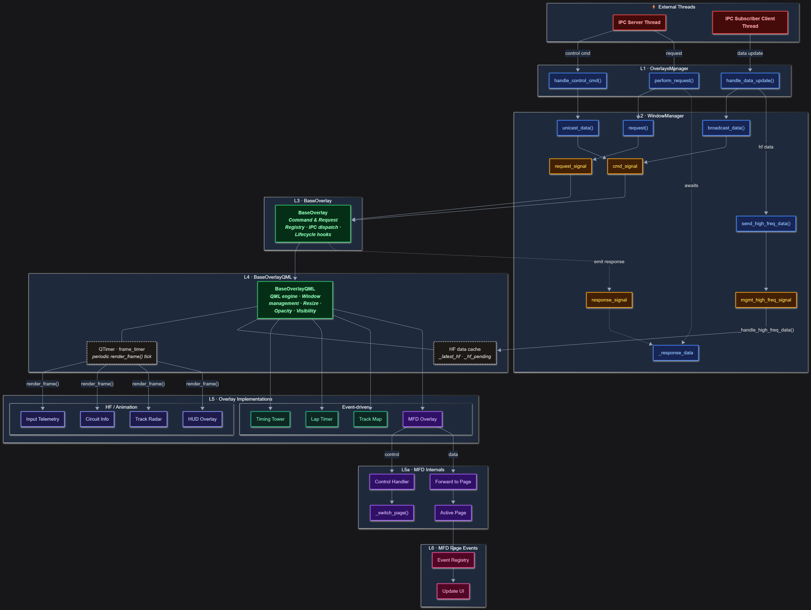

# Overlay Architecture (Top-Down Layered Design)

This document describes the internal architecture for the overlay system. The system is built on top of Qt signals and slots.
The system follows a strictly **top-down layered architecture**, where all primary flows move from **external inputs → managers → overlays → MFD internals → UI pages**.

Only **response signals** flow upward, and these paths are shown as **dotted arrows**.

---

## External Threads (Input Sources)

These threads act as the entry point for all data and control events:

- **IPC Server Thread** — receives command and request packets.
- **Socket.IO Client Thread** — receives real-time telemetry updates.

---

## L1 — OverlaysManager

Abstracts the external threads away from Qt related stuff.
Provides purpose specific convenience methods using the WindowManager API's.

---

## L2 — WindowManager

Inits and runs the overlay windows, while providing means of communicating with the windows.

### WindowManager API
- `broadcast_data()` — send data to all overlays
- `unicast_data()` — send commands to a specific overlay
- `request()` — synchronous request/response mechanism

### WindowManager Signals
- `cmd_signal`
- `request_signal`
- `response_signal`
- `_response_data`

---

## L3 — Overlay Base Layer

`BaseOverlay` provides:

- Command Registry
- Request Registry
- Shared overlay behavior
- Ability to emit responses upward via `response_signal`

---

## L4 — Implementation Layer

Actual overlays:

- Lap Timer Overlay
- Timing Tower Overlay
- MFD Overlay (specialized overlay)

### MFD Overlay

This overlay object is responsible for sub "pages". This layer handles controlling/managing the sub pages.

### Control Path
- Control Handler
- `_switch_page()`

### Data Path
- Forward to Page
- Active Page

---

## L5 — MFD Page Events

- Event Registry
- Update UI (final rendering step)

---

## Architecture Diagram

---

## Response Flow

Overlays may emit responses upward:

1. Overlay emits → `response_signal`
2. WindowManager stores → `_response_data`
3. OverlaysManager retrieves it via `perform_request()`

This is the **only upward flow** in an otherwise top-down architecture.

---

## Design Principles

* Strict vertical layering
* Unidirectional top-down flow
* Registry-based extensibility
* MFD logic isolated (L5–L6)
