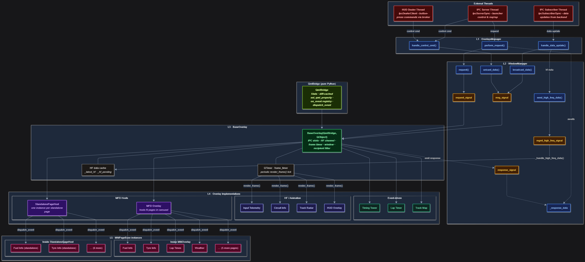

# Overlay Architecture (Top-Down Layered Design)

This document describes the internal architecture for the overlay system. The system is built on top of Qt signals and slots.
The system follows a strictly **top-down layered architecture**, where all primary flows move from **external inputs → managers → overlays → MFD pages → UI**.

Only **response signals** flow upward, and these paths are shown as **dotted arrows**.

---

## External Threads (Input Sources)

These threads act as the entry point for all data and control events:

- **IPC Server Thread** (`IpcServerSync`) — receives control commands and req/rep requests from the launcher (lock, opacity, layout, heartbeat, shutdown).
- **HUD Dealer Thread** (`IpcDealerClient`) — receives button-press commands routed from the backend via the ZeroMQ broker (toggle visibility, next/prev MFD page, MFD interact).
- **IPC Subscriber Thread** (`IpcSubscriberSync`) — receives real-time data updates from the backend (race-table-update, stream-overlay-update).

---

## L1 — OverlaysManager

Abstracts the external threads away from Qt related stuff.
Provides purpose-specific convenience methods using the WindowManager APIs.

---

## L2 — WindowManager

Inits and runs the overlay windows, while providing means of communicating with the windows.

### WindowManager API
- `broadcast_data()` — send data to all overlays
- `unicast_data()` — send commands to a specific overlay
- `send_high_freq_data()` — send high-frequency sensor data
- `request()` — synchronous request/response mechanism

### WindowManager Signals
- `msg_signal`
- `mgmt_high_freq_signal`
- `mgmt_request_signal`
- `mgmt_response_signal`
- `_response_data`

---

## QmlBridge (pure Python, no QObject)

Innermost shared base for both overlays and pages. Has no Qt dependency so pages are
testable without a Qt event loop:

- **Stats** — single `EventCounter` per component; `get_stats()`, `_track_event()`
- **Diff-cached property writes** — `set_qml_property(name, value)`, `invalidate_qml_cache()`,
  `_on_target_changed()` (clears cache on target swap)
- **Event handler registry** — `on_event(name)` decorator (always guarded on `qml_target is not None`),
  `dispatch_event(name, data)`, `get_handled_event_types()`
- **Abstract hook** — `qml_target` property; overlays return the root `QQuickWindow`, pages
  return the active `QQuickItem`

---

## L3 — BaseOverlay

`BaseOverlay(QmlBridge, QObject)` owns the window and the process-facing transport:

- IPC slots `_handle_cmd` / `_handle_request` / `_handle_high_freq_data`, `response_signal`
- Recipient filtering, visibility gating, cmd-pipeline latency tracking
- HF channel: `subscribe_hf`, `_latest_hf`, seq/loss accounting, `_hf_pending`
- Frame timer (`refresh_interval_ms`, `render_frame()`) — event-driven vs frame-driven is a
  **constructor parameter**, never a base-class choice
- Default handlers: `__set_opacity__`, `get_window_stats`, `__set_visibility__`, etc.
- `qml_target` → `self._root` (the `QQuickWindow`)

Concrete overlays subclass `BaseOverlay` directly (e.g. `TimingTowerOverlay`, `TrackRadarOverlay`,
`HudOverlay`, `MfdOverlay`, `StandalonePageHost`).

---

## L4 — Overlay Implementations

### Generic standalone overlays (subclass `BaseOverlay` directly)

Use for displays that will never live inside the MFD:

- **Lap Timer Overlay** — event-driven
- **Timing Tower Overlay** — event-driven
- **Track Map Overlay** — event-driven
- **Input Telemetry Overlay** — high-frequency frame-driven
- **Circuit Info Overlay** — high-frequency frame-driven
- **Track Radar Overlay** — high-frequency frame-driven
- **HUD Overlay** — high-frequency frame-driven

### MFD hosts (also subclass `BaseOverlay`)

- **`MfdOverlay`** — the MFD carousel; constructs and hosts N `MfdPageBase` instances, routes
  events to the active page via `dispatch_event`, composes `__PAGES__` stats
- **`StandalonePageHost`** — generic host that shows exactly one `MfdPageBase` in its own
  always-on-top window (`standalone_wrapper.qml`); written once, never subclassed

---

## L5 — MfdPageBase

`MfdPageBase(QmlBridge)` — hostable content with no window and no transport. Pages receive
events exclusively through their host calling `dispatch_event`.

- `KEY`, `PAGE_QML_FILE`, `OVERLAY_ID` class attributes
- Page-item lifecycle: `_on_page_activated`, `on_page_deactivated`, `is_active`
- `qml_target` → `self._page_item` (the active `QQuickItem`)
- `setup_page()` — abstract; concrete pages override with `@final`, register `@self.on_event`
  handlers, initialise business state
- `on_page_activated()` — optional override; called after the page item is live

### Concrete pages (subclass `MfdPageBase` and nothing else)

`FuelInfoPage`, `TyreInfoPage`, `LapTimesPage`, `WeatherForecastPage`, `TyreSetsPage`,
`PaceCompPage`, `PitRejoinPredictionPage`, `TrafficMonitorPage`, `CollapsedPage`

**Decision rule**: "Could a user want this inside the MFD?" → subclass `MfdPageBase` (a
standalone window comes free via `StandalonePageHost`). Otherwise → subclass `BaseOverlay`
directly.

---

## Architecture Diagram

---

## Response Flow

Overlays may emit responses upward:

1. Overlay emits → `response_signal`
2. WindowManager stores → `_response_data`
3. OverlaysManager retrieves it via `perform_request()`

This is the **only upward flow** in an otherwise top-down architecture.

---

## Design Principles

* Strict vertical layering — pages never own windows; windows never know about page internals
* Unidirectional top-down flow
* Composition over inheritance — `MfdOverlay` and `StandalonePageHost` *contain* pages
* Registry-based extensibility — event handlers registered via `@self.on_event`
* `QmlBridge` keeps stats and property caching at the innermost level so both overlays and
  pages share the same infrastructure without duplication
